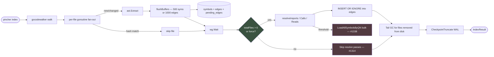
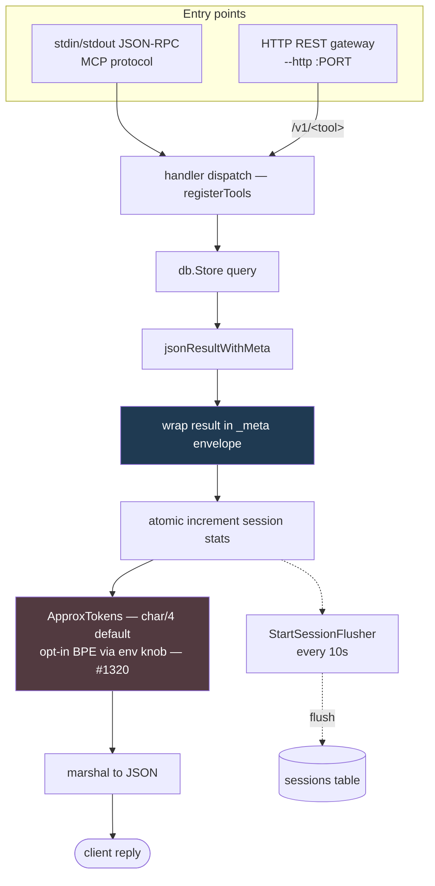
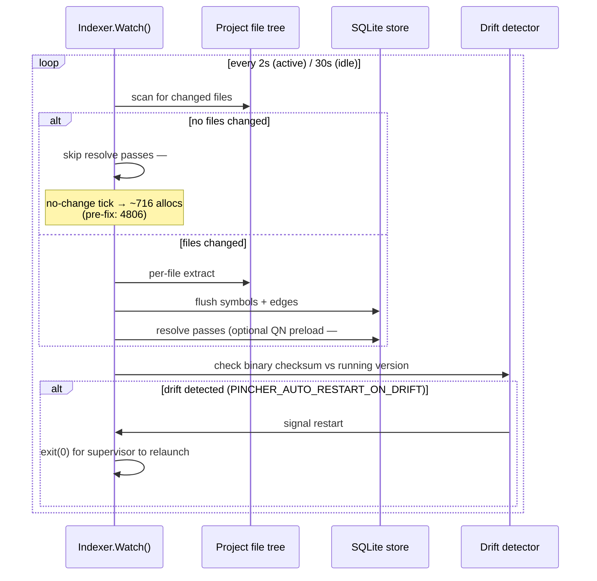

# Architecture diagrams

Visual reference for pincher's main subsystems. Each diagram is Mermaid so GitHub renders it inline — no SVG build step, no toolchain dependency. Update the source block here and the diagram updates everywhere it's embedded.

## Storage layers (the single-table three-index design)

```mermaid
flowchart TB
    subgraph ast["AST extraction (one pass per file)"]
      Walker[gocodewalker walks repo] -->|.gitignore-respecting| Goroutine[per-file goroutine]
      Goroutine -->|ast.ExtractWithModule| Extractor[language extractor]
      Extractor -->|ExtractedSymbol| Buffer[flushBuffers batches symbols+edges]
    end

    subgraph storage["Storage — symbols table serves 3 query paths"]
      Buffer --> Symbols[(symbols table)]
      Buffer --> Edges[(edges table)]
      Symbols -.->|byte offsets| ByteRetrieval[Layer 1 — O(1) byte seek<br/>GetSymbol → start_byte..end_byte]
      Symbols -.->|graph nodes| KnowledgeGraph[Layer 2 — knowledge graph<br/>pinchQL → SQL via cypher/engine]
      Symbols -.->|FTS5 mirror| FTS[Layer 3 — full-text search<br/>BM25 via symbols_fts virtual table]
      Edges -.-> KnowledgeGraph
    end

    style ByteRetrieval fill:#1f3a52,color:#fff
    style KnowledgeGraph fill:#1f3a52,color:#fff
    style FTS fill:#1f3a52,color:#fff
```

**Key invariants**: all three indexes are populated in a single `ast.Extract()` call. FTS5 triggers auto-sync the virtual table; never sync manually. `db.SetMaxOpenConns(1)` keeps the SQLite single-writer invariant; the reader pool handles SELECTs.

## Indexer pipeline (Index() flow)



**Key invariants**: per-project mutex + cross-process `acquireProjectLock` serialise concurrent indexers. Tail GC removes orphan symbols + file_hash rows for files no longer on disk (#326).

## MCP stack (request → response flow)



**Key invariants**: every handler ends in `jsonResultWithMeta` which atomically increments session stats. `_meta.capabilities` carries the per-server capability slice (opt-out via `PINCHER_META_CAPABILITIES=off`, #1087). HTTP gateway preserves the same handler set; no diverged code path.

## Watcher lifecycle (background re-index loop)



**Key invariants**: 2s active / 30s idle polling cadence. Drift detection compares the on-disk binary checksum against the running process; supervised mode (#705) re-launches automatically without manual `/mcp` reconnect. Auto-restart-on-drift requires `PINCHER_AUTO_RESTART_ON_DRIFT=1` in the MCP child's env.

## Authoring notes

- Source format: GitHub Markdown with Mermaid code fences. No build step.
- If a diagram drifts from the code, update the diagram in the same PR as the code change (per the v0.69 inline-update discipline).
- For ASCII fallback (e.g., terminal-only diff viewers), GitHub renders Mermaid as a `mermaid` code block. Readers without Mermaid support see the raw text, which is still readable as a flowchart definition.
